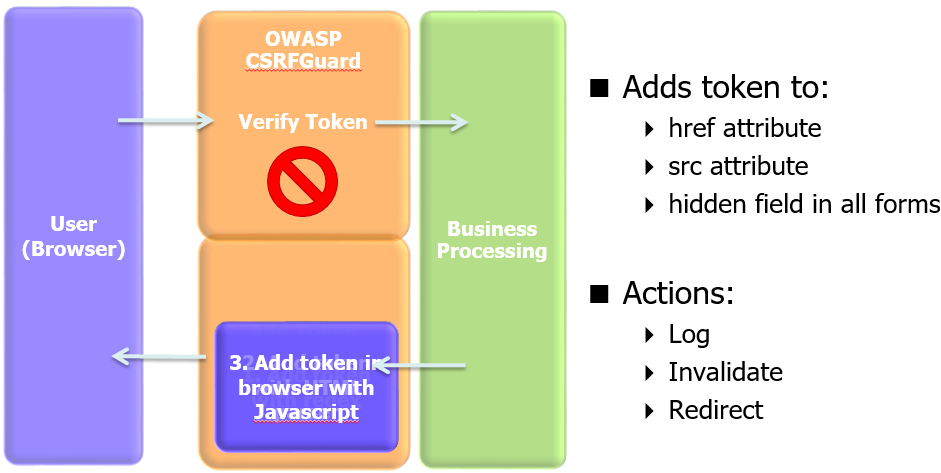
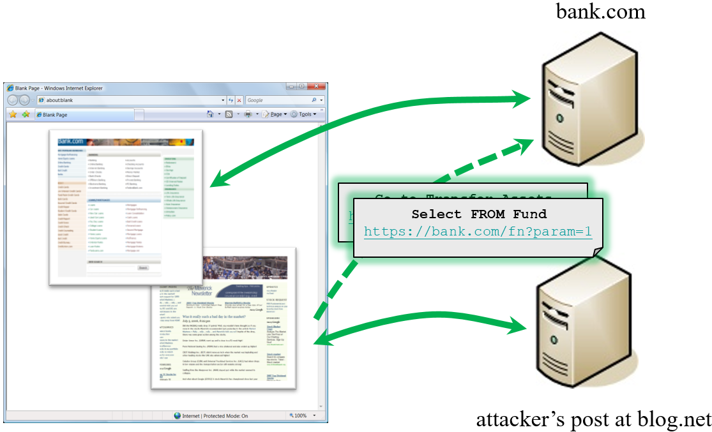
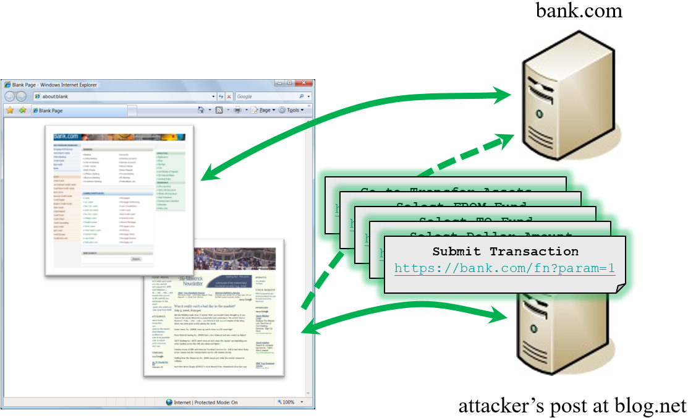

---

title: Features
layout: null
order: 1
tab: true
tags: csrfguard

---
# OWASP CSRFGuard 3.1.0

# Some CSRGuard features

## Tags

<iframe src=“https://bank.com/fn?param=1”>
<script src=“https://bank.com/fn?param=1”>

## Autoposting Forms
<body onload="document.forms[0].submit()">
<form method="POST" action=“https://bank.com/fn”>
   <input type="hidden" name="sp" value="8109"/>
</form>

## XmlHttpRequest
Subject to same origin policy

## Credentials Included

# How Does CSRF Work?

## What is CSRF (Cross-Site Request Forgery) Attacks

